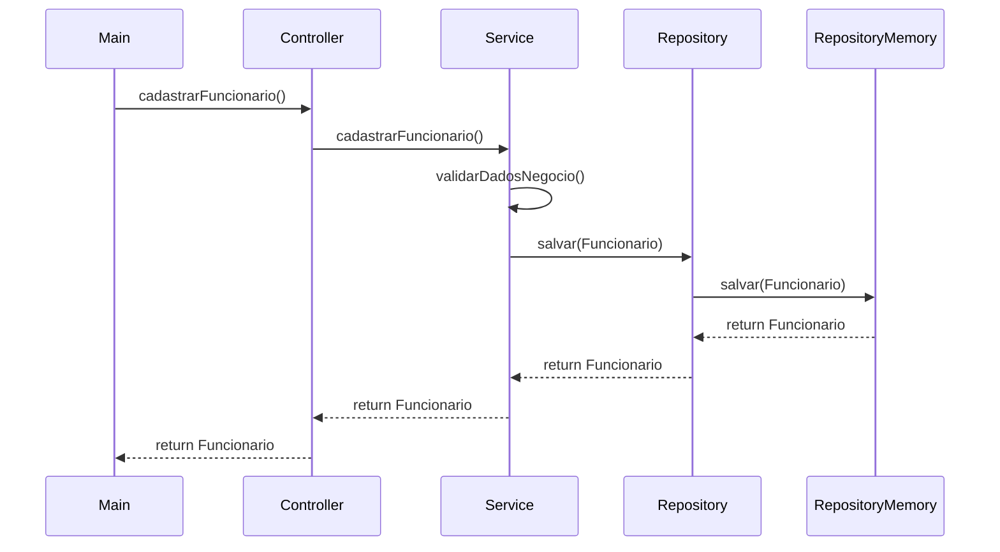

# Guia Completo: Arquitetura de 3 Camadas
## Sistema de CRUD de Funcionários - Projeto Prático

---

## Objetivo Deste Material

Este guia foi criado especialmente para você, aluno de Engenharia de Software, entender **NA PRÁTICA** como funciona a Arquitetura de 3 Camadas usando o projeto `funcionarios-crud` que implementamos em aula.

Você vai aprender:
-  O que é cada camada e qual sua responsabilidade
-  Como as camadas se comunicam entre si
-  Por onde "entrar" quando precisar fazer uma modificação
-  Como seguir o fluxo de dados no código

---

## Visão Geral da Arquitetura

### O que é Arquitetura de 3 Camadas?

É uma forma de **organizar o código** separando responsabilidades em 3 partes distintas:

```
┌─────────────────────────────────────────────────────┐
│          USUÁRIO (Console/Menu)                     │
└─────────────────────────────────────────────────────┘
                        ↓ interage com
┌─────────────────────────────────────────────────────┐
│   CAMADA 1: CONTROLLER (Apresentação)               │
│   • Recebe comandos do usuário                      │
│   • Valida entradas básicas                         │
│   • Chama o Service                                 │
└─────────────────────────────────────────────────────┘
                        ↓ delega para
┌─────────────────────────────────────────────────────┐
│   CAMADA 2: SERVICE (Negócio)                       │
│   • Aplica regras de negócio                        │
│   • Orquestra operações                             │
│   • Chama o Repository                              │
└─────────────────────────────────────────────────────┘
                        ↓ persiste via
┌─────────────────────────────────────────────────────┐
│   CAMADA 3: REPOSITORY (Dados)                      │
│   • Salva e recupera dados                          │
│   • Gerencia a "memória" (ArrayList)               │
└─────────────────────────────────────────────────────┘
                        ↓ manipula
┌─────────────────────────────────────────────────────┐
│   ENTITY: Funcionario (Modelo de Dados)             │
│   • Representa o objeto do mundo real               │
└─────────────────────────────────────────────────────┘
```

---

## Estrutura de Pacotes do Nosso Projeto

```
src/
├── Main.java                              # Ponto de entrada (menu)
├── controller/
│   └── FuncionarioController.java         # CAMADA 1
├── service/
│   └── FuncionarioService.java            # CAMADA 2
├── repository/
│   ├── FuncionarioRepository.java         # Interface
│   └── FuncionarioRepositoryMemoria.java  # CAMADA 3 (Implementação)
└── entity/
    └── Funcionario.java                   # Entidade
```

---

## Fluxo Completo: Cadastrar um Funcionário

Vamos seguir o caminho que os dados percorrem desde o usuário até serem salvos:

### Passo a Passo Visual

```
     USUÁRIO DIGITA NO CONSOLE
            ↓
    ┌───────────────────┐
    │    Main.java      │  ← Captura entrada do usuário
    │  (linha 62-82)    │
    └───────────────────┘
            ↓ chama
    funcionarioController.salvarFuncionario(nome, email, cpf, salario)
            ↓
┌──────────────────────────────────────────────────┐
│  FuncionarioController                             │
│  Método: salvarFuncionario()                       │
│  (linhas 17-25)                                    │
│                                                    │
│   O QUE FAZ:                                       │
│  • Valida se salário foi informado                 │
│  • Lança exceção se inválido                       │
│  • Delega para o Service                           │
└──────────────────────────────────────────────────┘
            ↓ chama
    funcionarioService.cadastrarFuncionario(nome, email, cpf, salario)
            ↓
┌──────────────────────────────────────────────────┐
│  FuncionarioService                                │
│  Método: cadastrarFuncionario()                    │
│  (linhas 18-29)                                    │
│                                                    │
│   O QUE FAZ:                                       │
│  • Valida regras de negócio                        │
│  • Cria objeto Funcionario                         │
│  • Chama Repository para salvar                    │
└──────────────────────────────────────────────────┘
            ↓ cria
    new Funcionario(nome, email, cpf, salario)
            ↓
┌──────────────────────────────────────────────────┐
│  Funcionario (Entity)                              │
│  Construtor (linhas 16-23)                         │
│                                                    │
│   O QUE FAZ:                                       │
│  • Gera ID automático                              │
│  • Valida dados (setters com regras)               │
│  • Define data de contratação                      │
└──────────────────────────────────────────────────┘
            ↓ retorna objeto criado
┌──────────────────────────────────────────────────┐
│  FuncionarioService                                │
│  (continuação)                                     │
└──────────────────────────────────────────────────┘
            ↓ chama
    repository.salvar(funcionario)
            ↓
┌──────────────────────────────────────────────────┐
│  FuncionarioRepositoryMemoria                      │
│  Método: salvar()                                  │
│  (linhas 12-25)                                    │
│                                                    │
│   O QUE FAZ:                                       │
│  • Verifica se CPF já existe                       │
│  • Adiciona na lista (ArrayList)                   │
│  • Retorna o funcionário salvo                      │
└──────────────────────────────────────────────────┘
            ↓ retorna
    Funcionário salvo com ID
            ↓ retorna
    Service retorna para Controller
            ↓ retorna
    Controller retorna para Main
            ↓
    EXIBE MENSAGEM DE SUCESSO NO CONSOLE
```

---

## Diagrama de Sequência — Operação: Salvar (Cadastrar) Funcionário



Observações e mapeamento para o código

- Fluxo principal (passo a passo mapeado para arquivos/métodos):
  1. Usuário interage com a aplicação (entrada no console) — `src/Main.java`.
  2. `Main` chama `FuncionarioController.salvarFuncionario(nome, email, cpf, salario)` — `src/controller/FuncionarioController.java`.
     - O `Controller` executa validação básica (por exemplo: `salario != null`) e, se válida, delega ao `Service`.
  3. `FuncionarioService.cadastrarFuncionario(...)` aplica regras de domínio — `src/service/FuncionarioService.java`.
     - Dentro do `Service` o método `validarDadosNegocio(...)` costuma chamar `repository.buscarPorCpf(cpf)` para garantir unicidade de CPF.
  4. Se o CPF estiver livre, o `Service` instancia `new Funcionario(nome, email, cpf, salario)` — `src/entity/Funcionario.java` (o construtor usa setters que validam atributos).
  5. O `Service` chama `repository.salvar(funcionario)` para persistir — implementação: `src/repository/FuncionarioRepositoryMemoria.java`.
     - O `Repository` realiza checagens de integridade (p.ex. revalidar CPF) e adiciona o objeto à lista em memória (`ArrayList`).
  6. O `Funcionario` salvo é retornado: Repository → Service → Controller → Main → Usuário (saída/feedback).

- Caminhos de erro (conforme o diagrama):
  - Falha de validação básica no `Controller` (ex.: salário nulo) → `IllegalArgumentException` e fluxo é interrompido antes do `Service`.
  - `validarDadosNegocio` no `Service` detecta CPF duplicado → lança exceção e operação é abortada.
  - Validações na construção do `Funcionario` (setters) podem lançar exceção (nome inválido, CPF/formato, salário abaixo do mínimo) — neste caso o `Service` captura/relança conforme o contrato local.

---

## CAMADA 1: Controller (Apresentação)

### Responsabilidade
**"Eu recebo os comandos do usuário e valido se faz sentido chamar o Service"**

### Arquivo: `FuncionarioController.java`

```java
public class FuncionarioController {
    
    private final FuncionarioService funcionarioService;
    
    // Injeção de Dependência: Controller PRECISA de um Service
    public FuncionarioController(FuncionarioService funcionarioService) {
        this.funcionarioService = funcionarioService;
    }
```

### Métodos Principais

1. Salvar Funcionário
```java
public Funcionario salvarFuncionario(String nome, String email, 
                                     String cpf, Double salario) {
    //  VALIDAÇÃO DE ENTRADA
    if (salario == null) {
        throw new IllegalArgumentException("Salário deve ser informado");
    }
    
    // DELEGA PARA O SERVICE
    return this.funcionarioService.cadastrarFuncionario(nome, email, cpf, salario);
}
```

**Entenda:**
- Controller **NÃO** sabe como criar o funcionário
- Controller **NÃO** sabe como salvar no banco/memória
- Controller apenas **valida entrada básica** e **repassa**

2. Listar Funcionários
```java
public List<Funcionario> listarFuncionarios() {
    return this.funcionarioService.listarFuncionarios();
}
```

**Entenda:**
- Método simples: apenas **repassa a chamada**
- Controller não adiciona lógica nenhuma aqui

3. Buscar por ID
```java
public Funcionario buscarPorId(Integer id) {
    if (id == null) 
        throw new IllegalArgumentException("ID deve ser informado");
    
    return this.funcionarioService.buscarFuncionarioPorId(id);
}
```

4. Deletar Funcionário
```java
public boolean deletarFuncionario(Integer id) {
    if (id == null) 
        throw new IllegalArgumentException("ID deve ser informado");
    
    return this.funcionarioService.removerFuncionario(id);
}
```

5. Atualizar Funcionário
```java
public boolean atualizarFuncionario(Integer id, String nome, 
                                    String email, Double salario) {
    if (id == null) 
        throw new IllegalArgumentException("ID deve ser informado");
    
    double salarioPrimitive = (salario == null) ? 0.0 : salario;
    
    return this.funcionarioService.atualizarFuncionario(
        id, nome, email, salarioPrimitive
    );
}
```

### Resumo do Controller

| O que FAZ | O que NÃO FAZ |
|-----------|---------------|
|  Recebe dados do usuário |  Não aplica regras de negócio |
|  Valida parâmetros básicos (null) |  Não acessa o banco de dados |
|  Chama o Service adequado |  Não cria objetos de negócio |
|  Retorna resultado |  Não sabe onde os dados são salvos |

---

## CAMADA 2: Service (Negócio)

###  Responsabilidade
**"Eu aplico as REGRAS DE NEGÓCIO e coordeno as operações"**

###  Arquivo: `FuncionarioService.java`

```java
public class FuncionarioService {
    
    private final FuncionarioRepository repository;
    
    // Injeção de Dependência: Service PRECISA de um Repository
    public FuncionarioService(FuncionarioRepository repository) {
        this.repository = repository;
    }
```

###  Métodos Principais

1. Cadastrar Funcionário (COM REGRAS DE NEGÓCIO)

```java
public Funcionario cadastrarFuncionario(String nome, String email, 
                                        String cpf, double salario) {
    try {
        // REGRA DE NEGÓCIO
        validarDadosNegocio(nome, email, cpf, salario);
        
        // CRIA O OBJETO (Entity)
        Funcionario funcionario = new Funcionario(nome, email, cpf, salario);
        
        // PERSISTE via Repository
        return repository.salvar(funcionario);
        
    } catch (Exception e) {
        throw new RuntimeException("Erro ao cadastrar funcionário: " 
                                   + e.getMessage(), e);
    }
}
```

**Entenda:**
1. Service **valida regras específicas do negócio**
2. Service **cria o objeto Funcionario**
3. Service **chama o Repository para salvar**
4. Service **trata exceções e dá mensagens adequadas**

2. Listar Funcionários (COM ORDENAÇÃO)

```java
public List<Funcionario> listarFuncionarios() {
    // Busca os dados
    List<Funcionario> funcionarios = repository.listarTodos();
    
    // REGRA DE NEGÓCIO: ordenar por nome
    funcionarios.sort((f1, f2) -> 
        f1.getNome().compareToIgnoreCase(f2.getNome())
    );
    
    return funcionarios;
}
```

**Entenda:**
- Repository retorna os dados "brutos"
- Service adiciona **lógica de ordenação** (regra de negócio)

3. Buscar por ID (COM VALIDAÇÃO)

```java
public Funcionario buscarFuncionarioPorId(int id) {
    Funcionario f = repository.buscarPorId(id);
    
    // REGRA: se não encontrou, lança exceção customizada
    if (f == null) {
        throw new RuntimeException("Funcionário não encontrado com ID: " + id);
    }
    
    return f;
}
```

4. Atualizar Funcionário (LÓGICA PARCIAL)

```java
public boolean atualizarFuncionario(int id, String nome, 
                                    String email, double salario) {
    // 1. Busca o funcionário existente
    Funcionario funcionario = repository.buscarPorId(id);
    
    if (funcionario == null) {
        throw new RuntimeException("Funcionário não encontrado com ID: " + id);
    }
    
    // 2. REGRA: atualizar apenas campos informados
    if (nome != null && !nome.trim().isEmpty()) {
        funcionario.setNome(nome);
    }
    if (email != null && !email.trim().isEmpty()) {
        funcionario.setEmail(email);
    }
    if (salario > 0) {
        funcionario.setSalario(salario);
    }
    
    // 3. Persiste as alterações
    return repository.atualizar(funcionario);
}
```

**Entenda:**
- Service **busca o objeto existente**
- Service **aplica lógica de atualização parcial** (só atualiza o que foi informado)
- Service **chama Repository para persistir**

5. Remover Funcionário

```java
public boolean removerFuncionario(int id) {
    // REGRA: verifica se existe antes de deletar
    if (repository.buscarPorId(id) == null) {
        throw new RuntimeException("Funcionário não encontrado com ID: " + id);
    }
    
    return repository.deletar(id);
}
```

6. Métodos de Negócio Avançados

```java
// Aplicar aumento salarial (REGRA DE NEGÓCIO PURA)
public boolean aplicarAumento(int id, double percentual) {
    Funcionario funcionario = buscarFuncionarioPorId(id);
    funcionario.aumentarSalario(percentual);  // método da Entity
    return repository.atualizar(funcionario);
}

// Relatório por faixa salarial (REGRA DE CONSULTA)
public List<Funcionario> buscarPorFaixaSalarial(double salarioMin, 
                                                 double salarioMax) {
    return repository.listarTodos().stream()
            .filter(f -> f.getSalario() >= salarioMin && 
                         f.getSalario() <= salarioMax)
            .sorted((f1, f2) -> Double.compare(f2.getSalario(), f1.getSalario()))
            .toList();
}
```

###  Resumo do Service

| O que FAZ | O que NÃO FAZ |
|-----------|---------------|
|  Aplica regras de negócio |  Não valida entrada de usuário |
|  Orquestra operações complexas |  Não acessa banco diretamente |
|  Valida regras de domínio |  Não formata dados para usuário |
|  Coordena Repository e Entity |  Não conhece detalhes de persistência |

---

## CAMADA 3: Repository (Dados)

###  Responsabilidade
**"Eu salvo e recupero dados. Não me importo com regras de negócio."**

###  Arquivos:
- `FuncionarioRepository.java` (Interface)
- `FuncionarioRepositoryMemoria.java` (Implementação)

###  Por que uma Interface?

```java
public interface FuncionarioRepository {
    Funcionario salvar(Funcionario funcionario);
    List<Funcionario> listarTodos();
    Funcionario buscarPorId(int id);
    Funcionario buscarPorCpf(String cpf);
    boolean atualizar(Funcionario funcionario);
    boolean deletar(int id);
    int contar();
}
```

**Entenda:**
- Interface define **O QUE** o Repository faz
- Implementação define **COMO** faz
- Podemos ter várias implementações:
    - `FuncionarioRepositoryMemoria` ← atual (usa ArrayList)
    - `FuncionarioRepositoryBD` ← futura (usaria MySQL)
    - `FuncionarioRepositoryArquivo` ← futura (usaria arquivo .txt)

** Vantagem:** Trocar a implementação **SEM ALTERAR** Service ou Controller!

###  Implementação em Memória

```java
public class FuncionarioRepositoryMemoria implements FuncionarioRepository {
    
    // "Banco de dados" em memória
    private final List<Funcionario> funcionarios = new ArrayList<>();
```

1. Salvar

```java
@Override
public Funcionario salvar(Funcionario funcionario) {
    if (funcionario == null) {
        throw new IllegalArgumentException("Funcionário não pode ser nulo");
    }
    
    // REGRA DE DADOS: não pode ter CPF duplicado
    if (buscarPorCpf(funcionario.getCpf()) != null) {
        throw new IllegalArgumentException("Já existe funcionário com este CPF");
    }
    
    // Adiciona na lista
    funcionarios.add(funcionario);
    return funcionario;
}
```

**Entenda:**
- Repository faz **validação de integridade de dados** (CPF único)
- Isso é diferente de regra de negócio!

2. Listar Todos

```java
@Override
public List<Funcionario> listarTodos() {
    // Retorna CÓPIA para evitar modificação externa
    return new ArrayList<>(funcionarios);
}
```

3. Buscar por ID

```java
@Override
public Funcionario buscarPorId(int id) {
    return funcionarios.stream()
            .filter(f -> f.getId() == id)
            .findFirst()
            .orElse(null);
}
```

**Entenda:**
- Usa Stream API do Java 8+
- Filtra pela condição
- Retorna primeiro encontrado ou `null`

4. Buscar por CPF

```java
@Override
public Funcionario buscarPorCpf(String cpf) {
    if (cpf == null) return null;
    
    String cpfLimpo = cpf.replaceAll("[^0-9]", "");
    
    for (Funcionario funcionario : funcionarios) {
        if (funcionario.getCpf().equals(cpfLimpo)) {
            return funcionario;
        }
    }
    return null;
}
```

5. Atualizar

```java
@Override
public boolean atualizar(Funcionario funcionario) {
    if (funcionario == null) return false;
    
    // Procura pelo ID
    for (int i = 0; i < funcionarios.size(); i++) {
        Funcionario existente = funcionarios.get(i);
        
        if (existente.getId() == funcionario.getId()) {
            // Valida CPF duplicado
            Funcionario porCpf = buscarPorCpf(funcionario.getCpf());
            if (porCpf != null && porCpf.getId() != funcionario.getId()) {
                throw new IllegalArgumentException(
                    "Já existe funcionário com este CPF"
                );
            }
            
            // Substitui na lista
            funcionarios.set(i, funcionario);
            return true;
        }
    }
    
    return false; // não encontrado
}
```

6. Deletar

```java
@Override
public boolean deletar(int id) {
    for (int i = 0; i < funcionarios.size(); i++) {
        if (funcionarios.get(i).getId() == id) {
            funcionarios.remove(i);
            return true;
        }
    }
    return false;
}
```

###  Resumo do Repository

| O que FAZ | O que NÃO FAZ |
|-----------|---------------|
|  Salva dados |  Não aplica regras de negócio |
|  Recupera dados |  Não valida lógica de domínio |
|  Garante integridade (CPF único) |  Não conhece regras de negócio |
|  Abstrai onde os dados estão |  Não formata dados para usuário |

---

## ENTITY: Funcionario (Modelo de Dados)

###  Responsabilidade
**"Eu represento um Funcionário do mundo real e garanto que meus dados sejam válidos"**

###  Arquivo: `Funcionario.java`

```java
public class Funcionario {
    // Gerador automático de ID
    private static int contadorId = 1;
    
    // Atributos
    private int id;
    private String nome;
    private String email;
    private String cpf;
    private double salario;
    private LocalDate dataContratacao;
```

###  Construtor com Validações

```java
public Funcionario(String nome, String email, String cpf, double salario) {
    this.id = contadorId++;  // ID automático
    setNome(nome);           // Chama setter com validação
    setEmail(email);
    setCpf(cpf);
    setSalario(salario);
    this.dataContratacao = LocalDate.now();
}
```

**Entenda:**
- Construtor **sempre chama os setters**
- Isso garante que **validações sejam aplicadas**

###  Setters com Validação (POO!)

Validar Nome
```java
public void setNome(String nome) {
    if (nome == null || nome.trim().length() < 2) {
        throw new IllegalArgumentException(
            "Nome deve ter pelo menos 2 caracteres"
        );
    }
    this.nome = nome.trim();
}
```

Validar Email
```java
public void setEmail(String email) {
    if (email == null || !email.contains("@") || !email.contains(".")) {
        throw new IllegalArgumentException("Email inválido");
    }
    this.email = email.toLowerCase().trim();
}
```

Validar CPF
```java
public void setCpf(String cpf) {
    if (cpf == null || cpf.replaceAll("[^0-9]", "").length() != 11) {
        throw new IllegalArgumentException("CPF deve ter 11 dígitos");
    }
    this.cpf = cpf.replaceAll("[^0-9]", "");  // Remove formatação
}
```

Validar Salário
```java
public void setSalario(double salario) {
    if (salario < 1320.0) {  // Salário mínimo 2025
        throw new IllegalArgumentException(
            "Salário não pode ser menor que o mínimo"
        );
    }
    this.salario = salario;
}
```

**Entenda:**
- Entity garante que **nunca existirá um objeto inválido**
- Validações acontecem **no momento da criação/modificação**

###  Métodos de Negócio na Entity

```java
// Aumentar salário
public void aumentarSalario(double percentual) {
    if (percentual > 0 && percentual <= 100) {
        this.salario *= (1 + percentual / 100);
    } else {
        throw new IllegalArgumentException(
            "Percentual deve estar entre 0 e 100"
        );
    }
}

// Formatar CPF
public String getCpfFormatado() {
    return cpf.replaceAll("(\\d{3})(\\d{3})(\\d{3})(\\d{2})", 
                          "$1.$2.$3-$4");
}
```

###  Métodos Obrigatórios de Object

toString (para exibição)
```java
@Override
public String toString() {
    return String.format(
        "Funcionario{id=%d, nome='%s', email='%s', cpf='%s', salario=%.2f, dataContratacao=%s}",
        id, nome, email, getCpfFormatado(), salario, dataContratacao
    );
}
```

equals (comparação)
```java
@Override
public boolean equals(Object obj) {
    if (this == obj) return true;
    if (obj == null || getClass() != obj.getClass()) return false;
    Funcionario that = (Funcionario) obj;
    return Objects.equals(cpf, that.cpf);  // Compara por CPF
}
```

hashCode (para collections)
```java
@Override
public int hashCode() {
    return Objects.hash(cpf);
}
```

**Entenda:**
- `equals` define quando dois funcionários são **iguais** (mesmo CPF)
- `hashCode` é necessário para usar em HashMap, HashSet etc

###  Resumo da Entity

| O que FAZ | O que NÃO FAZ |
|-----------|---------------|
|  Representa dados do mundo real |  Não sabe onde é salva |
|  Valida seus próprios atributos |  Não faz operações de CRUD |
|  Contém métodos de negócio simples |  Não orquestra operações complexas |
|  Garante integridade do objeto |  Não conhece outras entidades |

---

##  Main.java - Ponto de Entrada

###  Responsabilidade
**"Eu sou o menu do sistema. Capturo entrada do usuário e chamo o Controller."**

###  Inicialização (Injeção Manual de Dependências)

```java
public static void main(String[] args) {
    // 3. Cria o Repository (camada mais baixa)
    FuncionarioRepository funcionarioRepository = 
        new FuncionarioRepositoryMemoria();
    
    // 2. Cria o Service (precisa do Repository)
    FuncionarioService funcionarioService = 
        new FuncionarioService(funcionarioRepository);
    
    // 1. Cria o Controller (precisa do Service)
    FuncionarioController funcionarioController = 
        new FuncionarioController(funcionarioService);
    
    // Loop do menu
    while (true) {
        // ... exibe menu e processa opções
    }
}
```

** Entenda: **
1. **Repository** não depende de ninguém
2. **Service** depende de Repository
3. **Controller** depende de Service
4. Main **injeta as dependências manualmente**

### Diagrama de Dependências

```
┌──────────────────┐
│  Repository      │  ← Não depende de nada
└──────────────────┘
         ↑
         │ injetado em
┌──────────────────┐
│  Service         │  ← Depende de Repository
└──────────────────┘
         ↑
         │ injetado em
┌──────────────────┐
│  Controller      │  ← Depende de Service
└──────────────────┘
         ↑
         │ usado por
┌──────────────────┐
│  Main            │  ← Usa Controller
└──────────────────┘
```

---

## Fluxos Completos de Todas as Operações

1. CREATE (Cadastrar Funcionário)

```
USUÁRIO
  ↓ digita dados
MAIN (cadastrarFuncionario)
  ↓ chama
CONTROLLER.salvarFuncionario(nome, email, cpf, salario)
  ├─ Valida: salário != null
  ↓ chama
SERVICE.cadastrarFuncionario(nome, email, cpf, salario)
  ├─ Valida: dados de negócio
  ├─ Cria: new Funcionario(...)
  ↓ chama
REPOSITORY.salvar(funcionario)
  ├─ Valida: CPF não duplicado
  ├─ Adiciona na lista
  ↓ retorna
Funcionario salvo
  ↓ retorna
SERVICE retorna Funcionario
  ↓ retorna
CONTROLLER retorna Funcionario
  ↓ retorna
MAIN exibe sucesso
```

2. READ (Listar Funcionários)

```
USUÁRIO
  ↓ escolhe opção 2
MAIN (listarFuncionarios)
  ↓ chama
CONTROLLER.listarFuncionarios()
  ↓ chama
SERVICE.listarFuncionarios()
  ├─ Chama repository.listarTodos()
  ├─ Ordena por nome (regra de negócio)
  ↓ retorna
Lista<Funcionario> ordenada
  ↓ retorna
CONTROLLER retorna lista
  ↓ retorna
MAIN exibe lista no console
```

3. READ BY ID (Buscar por ID)

```
USUÁRIO
  ↓ digita ID
MAIN (buscarFuncionarioPorId)
  ↓ chama
CONTROLLER.buscarPorId(id)
  ├─ Valida: id != null
  ↓ chama
SERVICE.buscarFuncionarioPorId(id)
  ├─ Chama repository.buscarPorId(id)
  ├─ Valida: se null, lança exceção
  ↓ retorna
Funcionario encontrado
  ↓ retorna
CONTROLLER retorna Funcionario
  ↓ retorna
MAIN exibe funcionário
```

4. UPDATE (Atualizar Funcionário)

```
USUÁRIO
  ↓ digita ID e novos dados
MAIN (atualizarFuncionario)
  ↓ chama
CONTROLLER.atualizarFuncionario(id, nome, email, salario)
  ├─ Valida: id != null
  ↓ chama
SERVICE.atualizarFuncionario(id, nome, email, salario)
  ├─ Busca funcionário existente
  ├─ Aplica lógica: atualiza apenas campos informados
  ↓ chama
REPOSITORY.atualizar(funcionario)
  ├─ Valida: CPF não conflita
  ├─ Substitui na lista
  ↓ retorna
true (sucesso)
  ↓ retorna
SERVICE retorna true
  ↓ retorna
CONTROLLER retorna true
  ↓ retorna
MAIN exibe sucesso
```

5. DELETE (Deletar Funcionário)

```
USUÁRIO
  ↓ digita ID
MAIN (deletarFuncionario)
  ↓ chama
CONTROLLER.deletarFuncionario(id)
  ├─ Valida: id != null
  ↓ chama
SERVICE.removerFuncionario(id)
  ├─ Valida: funcionário existe
  ↓ chama
REPOSITORY.deletar(id)
  ├─ Remove da lista
  ↓ retorna
true (sucesso)
  ↓ retorna
SERVICE retorna true
  ↓ retorna
CONTROLLER retorna true
  ↓ retorna
MAIN exibe sucesso
```

---

## Guia Prático: "Por Onde Eu Começo?"

### Cenário: Adicionar Nova Funcionalidade

**Exemplo: Adicionar método "buscarPorNome"**

Passo 1: Repository (Camada de Dados)
```java
// FuncionarioRepository.java
List<Funcionario> buscarPorNome(String nome);

// FuncionarioRepositoryMemoria.java
@Override
public List<Funcionario> buscarPorNome(String nome) {
    return funcionarios.stream()
        .filter(f -> f.getNome().toLowerCase().contains(nome.toLowerCase()))
        .collect(Collectors.toList());
}
```

Passo 2: Service (Camada de Negócio)
```java
// FuncionarioService.java
public List<Funcionario> buscarPorNome(String nome) {
    if (nome == null || nome.trim().isEmpty()) {
        throw new IllegalArgumentException("Nome deve ser informado");
    }
    
    List<Funcionario> resultado = repository.buscarPorNome(nome);
    
    // Ordenar por nome (regra de negócio)
    resultado.sort((f1, f2) -> f1.getNome().compareToIgnoreCase(f2.getNome()));
    
    return resultado;
}
```

Passo 3: Controller (Camada de Apresentação)
```java
// FuncionarioController.java
public List<Funcionario> buscarPorNome(String nome) {
    if (nome == null || nome.trim().isEmpty()) {
        throw new IllegalArgumentException("Nome deve ser informado");
    }
    
    return funcionarioService.buscarPorNome(nome);
}
```

Passo 4: Main (Interface com Usuário)
```java
// Main.java
private static void buscarPorNome(FuncionarioController controller) {
    System.out.print("Digite o nome a buscar: ");
    String nome = scanner.nextLine().trim();
    
    List<Funcionario> funcionarios = controller.buscarPorNome(nome);
    
    if (funcionarios.isEmpty()) {
        System.out.println("Nenhum funcionário encontrado.");
    } else {
        funcionarios.forEach(System.out::println);
    }
}
```

###  Ordem Sempre é a Mesma

```
1. Repository  (acesso aos dados)
   ↓
2. Service     (lógica de negócio)
   ↓
3. Controller  (validação de entrada)
   ↓
4. Main        (interação com usuário)
```

---

## Testando Mentalmente o Código

###  Perguntas para Se Fazer

Quando estiver lendo ou modificando código, pergunte:

No Controller:
-  Estou apenas validando entradas?
-  Estou delegando para o Service?
-  Tem regra de negócio aqui? (ERRADO!)
-  Estou acessando Repository diretamente? (ERRADO!)

No Service:
-  Estou aplicando regras de negócio?
-  Estou coordenando Repository e Entity?
-  Estou validando entrada do usuário? (Isso é do Controller!)
-  Estou fazendo SQL diretamente? (Isso é do Repository!)

No Repository:
-  Estou salvando/recuperando dados?
-  Estou garantindo integridade (ex: CPF único)?
-  Tem cálculo de negócio aqui? (ERRADO!)
-  Estou formatando dados para usuário? (ERRADO!)

---

## Exercícios Práticos

1. Exercício 1: Trace o Fluxo
   Desenhe no papel o fluxo completo de quando o usuário escolhe "5. Atualizar funcionário".

2. Exercício 2: Adicione Funcionalidade
   Implemente o método "buscar funcionários com salário acima de X".
- Repository: crie o método
- Service: adicione regra de ordenação
- Controller: adicione validação
- Main: crie o menu

3. Exercício 3: Identifique o Erro
   Código errado:
```java
// FuncionarioController.java
public Funcionario salvar(String nome, String cpf, double salario) {
    Funcionario f = new Funcionario(nome, "", cpf, salario);
    
    //  ERRO: Controller acessando Repository direto!
    return repository.salvar(f);
}
```

**Pergunta:** Qual camada foi "pulada"? Por que isso é ruim?

**Resposta:** O Service foi pulado. É ruim porque:
- Regras de negócio não são aplicadas
- Não há validação adequada
- Quebra a separação de responsabilidades

---

##  Resumo Final: Tabela de Referência Rápida

| Camada | Arquivo | Responsabilidade | O que FAZ | O que NÃO FAZ |
|--------|---------|------------------|-----------|---------------|
| Controller | `FuncionarioController.java` | Receber comandos | Valida entrada, chama Service |  Regras de negócio, acesso a dados |
| Service | `FuncionarioService.java` | Lógica de negócio | Aplica regras, coordena Repository |  Acesso direto a dados, validação de entrada |
| Repository | `FuncionarioRepositoryMemoria.java` | Persistência | Salva/recupera dados |  Regras de negócio, formatação |
| Entity | `Funcionario.java` | Modelo de dados | Representa objeto, valida-se |  Não faz operações de CRUD |
| Main | `Main.java` | Interface usuário | Captura entrada, exibe saída |  Lógica de negócio |

---

##  Próximos Passos

### 1. Entenda o Código Atual
- [ ] Leia cada camada separadamente
- [ ] Trace um fluxo completo no papel
- [ ] Execute o programa e observe

### 2. Pratique Modificações
- [ ] Adicione novo atributo (ex: telefone)
- [ ] Adicione nova busca (ex: por email)
- [ ] Adicione validação extra

### 3. Evolua a Arquitetura
- [ ] Implemente Repository com arquivo
- [ ] Implemente Repository com banco de dados
- [ ] Adicione camada de DTO (Data Transfer Object)

---

## Dicas de Ouro

###  Dica 1: Siga o Fluxo
Sempre que for modificar algo, pergunte:
```
"Por onde o dado entra?" → Main
"Quem valida entrada?" → Controller
"Quem aplica regra?" → Service
"Quem salva?" → Repository
```

###  Dica 2: Nunca Pule Camadas
```
 Controller → Repository (ERRADO!)
 Controller → Service → Repository (CERTO!)
```

###  Dica 3: Use os Nomes Certos
```
Controller → métodos descrevem ações do usuário
Service → métodos descrevem operações de negócio
Repository → métodos descrevem operações de dados
```

###  Dica 4: Leia de Baixo para Cima
Para entender:
```
1º Leia Entity (o que é um Funcionário?)
2º Leia Repository (como salvar?)
3º Leia Service (quais regras aplicar?)
4º Leia Controller (como receber comandos?)
5º Leia Main (como usuário interage?)
```

---

##  Checklist de Compreensão

Marque o que você já entende:

- [ ] Sei o que é cada camada (Controller, Service, Repository)
- [ ] Sei o que é a Entity (Funcionario)
- [ ] Entendo o fluxo de CREATE (cadastrar)
- [ ] Entendo o fluxo de READ (listar/buscar)
- [ ] Entendo o fluxo de UPDATE (atualizar)
- [ ] Entendo o fluxo de DELETE (deletar)
- [ ] Sei por onde começar para adicionar funcionalidade
- [ ] Entendo por que não devemos "pular" camadas
- [ ] Sei identificar se código está na camada errada
- [ ] Consigo explicar para um colega

---

## Glossário de Termos

| Termo | Significado | Exemplo no Projeto |
|-------|-------------|-------------------|
| Camada | Divisão lógica do código | Controller, Service, Repository |
| Injeção de Dependência | Passar dependências via construtor | `new FuncionarioService(repository)` |
| Separação de Preocupações | Cada parte faz uma coisa só | Controller só valida entrada |
| Acoplamento | Dependência entre classes | Service precisa de Repository |
| Interface | Contrato (o que fazer) | `FuncionarioRepository` |
| Implementação | Como fazer | `FuncionarioRepositoryMemoria` |
| Entity | Objeto do mundo real | `Funcionario` |
| CRUD | Create, Read, Update, Delete | Operações básicas |
| Validação | Verificar se dados são válidos | `if (salario < 1320)` |
| Persistência | Salvar dados | `repository.salvar()` |

---

##  Conclusão

Você agora tem um guia completo do projeto `funcionarios-crud` que implementamos em aula!

**Lembre-se:**
1. Controller recebe comandos
2. Service aplica regras de negócio
3. Repository salva/recupera dados
4. Entity representa o objeto

**O fluxo é sempre:**
```
Main → Controller → Service → Repository → Dados
```

**Continue praticando e boa sorte! **
